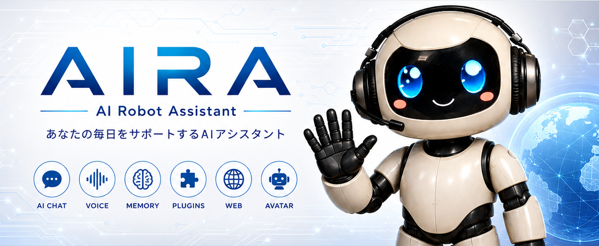
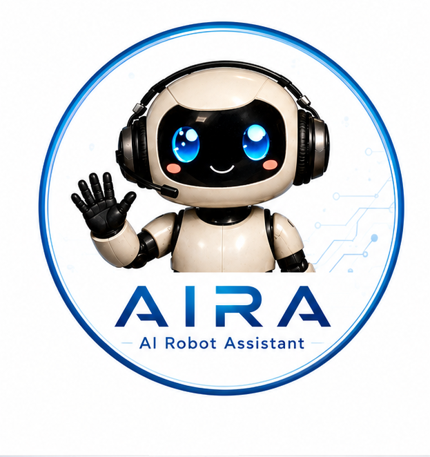

# AIRA

<p align="center">
  
</p>

<p align="center">
  
</p>

<h1 align="center">AIRA - AI Robot Assistant</h1>

<p align="center">
ローカルで動作するオープンソースAIアシスタント
</p>

---

## AIRAとは

AIRA（AI Robot Assistant）は、PythonとOllamaを利用したローカルAIアシスタントです。

音声認識、音声合成、VRMアバター、RAG（知識追加）、Web検索、プラグイン機能などを統合し、誰でも自由に拡張できるAIアシスタントを目指しています。

---

## AIRA Avatar

<p align="center">
  
</p>

---

# 主な機能

- AIチャット
- Ollama接続
- プラグイン管理
- ログ管理
- JSON設定管理
- モジュール化設計

---

# 動作環境

- Windows 10 / Windows 11
- Python 3.12以上
- Ollama

---

# インストール

```bash
git clone https://github.com/masao2022/AIRA.git
cd AIRA
```

仮想環境

```bash
python -m venv .venv
```

Windows

```bash
.venv\Scripts\activate
```

ライブラリ

```bash
pip install -r requirements.txt
```

Ollamaモデル

```bash
ollama pull gemma3:4b
```

起動

```bash
python app.py
```

---

# ロードマップ

- AIチャット
- 長期記憶(SQLite)
- VOICEVOX
- Whisper
- VRMアバター
- Web検索
- PDF・Word・Excel対応RAG
- Discord Bot
- LINE Bot

---

# ライセンス

MIT License

---

# 作者

**まさお**

AIRA Project